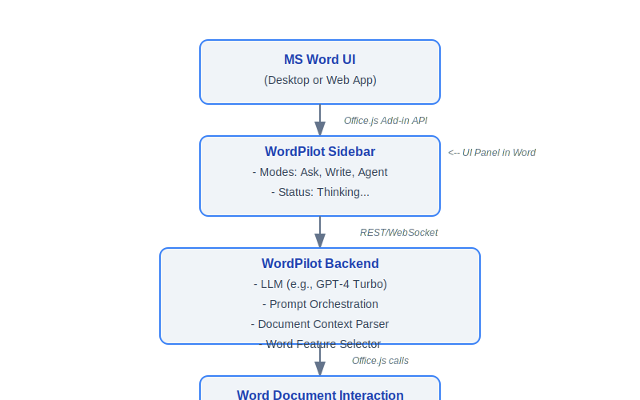

# ✨ WordPilot

> **The AI Sidebar Copilot for Microsoft Word**

WordPilot is a next-generation AI-powered writing assistant that seamlessly integrates into Microsoft Word. It delivers real-time document editing, contextual intelligence, and comprehensive control over Word's capabilities—providing professional, human-like writing assistance that significantly surpasses Microsoft's limited Copilot offering.

**Think of it as Cursor IDE meets MS Word** – an intelligent agent that *thinks*, *plans*, and *writes* like a human, while fully understanding all of Word's advanced formatting and layout tools.

## 🚀 Vision

Microsoft Copilot is expensive, restricted to enterprise plans, and lacks the depth and flexibility modern users need. **WordPilot** changes that by:

- Understanding formatting, document structure, and writing standards—not just generating text
- Integrating directly into Word's UI with a **sidebar interface** inspired by **Cursor IDE**
- Operating in **three powerful modes**: `Ask`, `Write`, and `Agent`

## 🎯 Key Features

### 🧠 Sidebar Modes

| Mode | Description |
|------|-------------|
| **Ask** | Chat-style interface to get help, ask questions, or clarify writing concepts |
| **Write** | Generates content based on prompts and inserts it directly into the document |
| **Agent** | Full intelligent mode that understands prompts, plans content, formats output, and writes in real-time |

### 🛠 Real-Time, In-Document Writing

When you prompt: **"Write about India in 100 words."**

WordPilot will:
1. Display a thoughtful response in the chat:
   - _"Thinking..."_
   - _"Planning structure..."_
   - _"Inserting content now..."_
   
2. Begin typing in your Word document:
   - With correct paragraph formatting
   - Maintaining font consistency
   - Showing progress as it writes section by section

### 🧾 Full Word Feature Control

Unlike basic AI writing tools, **WordPilot** intelligently uses all major Word features:

- **Text Styling:** Bold, Italics, Underline, Headings, Lists
- **Document Layouts:** Section breaks, Columns, Indents, Margins
- **Advanced Elements:**
  - ✅ Tables
  - ✅ Equations
  - ✅ Symbols
  - ✅ WordArt & SmartArt
  - ✅ Images with captions
  - ✅ References and Citations
  - ✅ Footnotes and Endnotes

### 📚 Example Use Cases

#### 📝 Academic Writing

> "Write an abstract in IEEE 2-column format about the benefits of quantum computing."

- Automatically sets document layout to two columns
- Inserts formatted abstract section
- Adds relevant citations

#### 📄 Business Documents

> "Draft a professional memo regarding Q2 sales dip."

- Uses business memo format
- Adds header, date, subject
- Writes in formal tone with bullet points

#### 🧑‍🎓 Student Use

> "Insert a table comparing renewable vs non-renewable energy."

- Creates and inserts a properly styled table with appropriate headers

## 🧱 Architecture Overview

## ⚙️ Technologies

- **Microsoft Word Add-in Platform** using [Office.js](https://learn.microsoft.com/en-us/javascript/api/overview/office)
- **React/Next.js** for sidebar UI
- **Node.js/Express** for backend logic
- **GPT-4-turbo (or other LLMs)** as the core writing agent
- **Office.js APIs** to insert, style, and manipulate content

## 📌 Future Ideas

- ✨ **Voice Input Mode**
- 🧠 **Customizable Personality / Tone Settings**
- 📄 **Auto-format CVs, Resumes, Cover Letters**
- 🧾 **Citation Manager with Zotero/Mendeley API**
- 🔍 **Context-aware grammar and tone suggestions**
- 🌐 **Web research agent** (browse and cite real-time sources)

## ✅ Why WordPilot Wins

| Feature | Microsoft Copilot | WordPilot |
|---------|-------------------|-----------|
| Available for all users | ❌ Enterprise only | ✅ Yes |
| Real-time in-document writing | ❌ No | ✅ Yes |
| Custom agent behaviors | ❌ No | ✅ Yes |
| Full control of Word features | ❌ Partial | ✅ Yes |
| Open customization / Extendable | ❌ Closed | ✅ Full |

## 🙌 Contributing

If you're passionate about AI, language, and productivity tooling, we welcome contributions. Join us in building the world's smartest document assistant.

## 📩 Contact / Collaboration

Have ideas? Want to integrate with your product?  
Drop a message: [maheshsharan28@gmail.com]

> "Don't just write with Word. Write with intelligence."  
> — WordPilot Team
